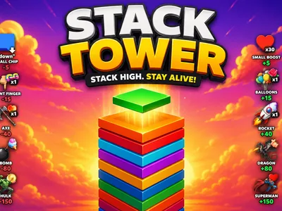
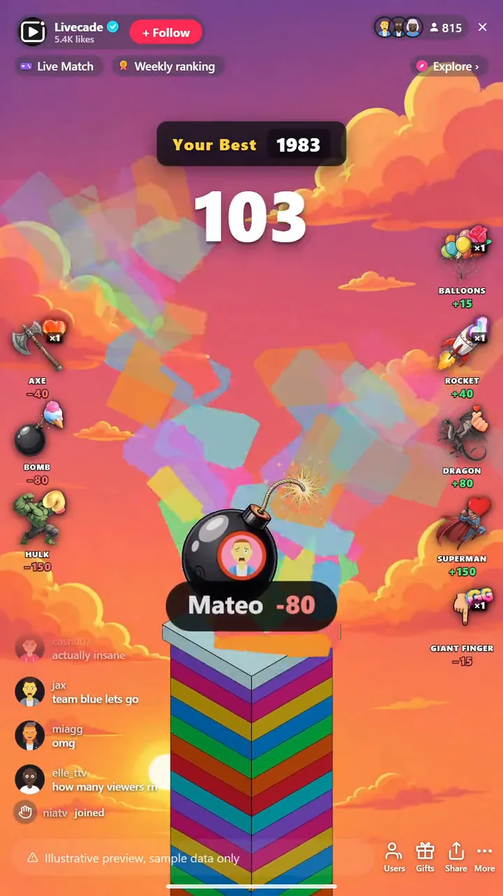

# Stack Tower - Interactive TikTok Live Game

> Stack the tower sky-high while your chat builds it and knocks it down.

Stack a tower as high as you can while your viewers help and sabotage it live. A block slides across the top and drops, gifts slam on rockets and dragons to build it, and knock-downs like the bomb and Hulk crumble it. Beat your best.

**[Play Stack Tower on Livecade](https://livecade.io/games/tower-stack/?utm_source=github&utm_medium=readme&utm_campaign=tower-stack)** - runs as a single browser source in OBS, Streamlabs, or TikTok LIVE Studio. Nothing for viewers to install.

## How viewers play

Viewers take part with the actions TikTok already gives them: **comments**, **gifts**, **likes**. Every action below is rebindable, so you decide which interaction drives which effect.

| Action | What it does |
| --- | --- |
| **Small Boost (+5)** | Adds a few blocks to the tower |
| **Balloons (+15)** | Floats a batch of blocks up onto the tower |
| **Rocket (+40)** | Blasts a stack of blocks on, crediting the sender |
| **Dragon (+80)** | Swoops in and drops a big stack with a screen shake |
| **Superman (+150)** | A mega boost that lifts a huge stack at once |
| **Small Chip (-5)** | Knocks a couple of blocks off the top |
| **Giant Finger (-15) / Axe (-40)** | Flicks or chops blocks off the tower |
| **Bomb (-80) / Hulk (-150)** | Detonates or smashes a big chunk of the tower down |

## How it works

### Stack it clean

A block slides across the top and drops. Line it up for a perfect stack that keeps the tower wide, or miss and the overhang shaves off. Stack it yourself by clicking, or let it run on auto.

### Gifts build and sabotage

Boost gifts pile blocks on fast, from balloons to a rocket, a dragon, and a mega Superman. Sabotage gifts crumble it back down, from a giant finger and axe to a bomb and a screen-shaking Hulk. Every hero effect credits the viewer who sent it.

### Climb the sky, chase the record

As the tower grows the sky climbs from day to the cosmos, and sabotage can sink it underground toward the abyss. It tracks your all-time best and celebrates a NEW RECORD, or chase a custom goal you set.

## About the game

Stack Tower is the classic stacking game turned into a live co-op battle with your chat. A block slides across the top and drops onto the tower: line it up for a clean stack, miss and the overhang shaves off. You can stack it yourself by clicking, or let it stack on auto while the whole game becomes about what your viewers do.

### Chat builds it up or tears it down

Boost gifts pile blocks on fast, from a small heart to balloons, a rocket, a dragon and a mega Superman that lifts a huge stack at once, each one crediting the viewer who sent it with their face and name. Sabotage gifts crumble it back down, from a giant finger and axe up to a bomb and a screen-shaking Hulk.

### The sky tells you how it is going

As the tower climbs it changes with it, day to sunset to space to the cosmos, and if the sabotage wins it sinks underground toward the abyss. It tracks your all-time best and fires a NEW RECORD celebration when you beat it, or you can set a custom goal to chase.

## What it looks like on stream

[Watch Stack Tower gameplay](https://cdn.livecade.io/games/tower-stack.mp4)

## What you can configure

- **Interface language** - Twelve languages for the on-screen chrome
- **Stacking mode** - Stack it yourself by clicking, or let it stack on auto
- **Auto stack tempo** - How fast the tower builds itself in auto mode
- **Background changes with height** - The sky climbs from day to the cosmos, or sinks to the abyss
- **Deepest the pit can go** - Caps how far sabotage can sink the tower underground
- **Record banner** - Track your all-time best, or set a custom goal to chase

## Languages

English, Spanish, Portuguese, French, German, Italian, Indonesian, Arabic, Turkish, Russian, Hindi, Romanian

## FAQ

<strong>How do viewers interact with Stack Tower?</strong>

Viewers send gifts to build the tower or knock it down, and each boost credits the sender with their face and name. Likes and comments can be bound to the free boost and chip too, so any audience size can join in.

<strong>Do I stack the tower or does it stack itself?</strong>

Both are options. In manual mode you click to drop each block, so it is a skill game. In auto mode the tower stacks itself and the whole game becomes about what your viewers build and sabotage.

<strong>What do the gifts do?</strong>

Boost gifts add blocks, from a small heart and balloons up to a rocket, a dragon, and a mega Superman. Sabotage gifts crumble the tower, from a giant finger and axe to a bomb and a Hulk. Every action is rebindable to the gift you want.

<strong>How do I add Stack Tower to my TikTok Live?</strong>

Add one browser source URL to OBS or your streaming software and go live. There is no plugin to install and nothing for your viewers to download.

## Setup

1. [Create a Livecade account](https://app.livecade.io/register?utm_source=github&utm_medium=cta&utm_campaign=tower-stack)
2. Copy your overlay browser source URL
3. Paste it into OBS, Streamlabs, or TikTok LIVE Studio
4. Pick Stack Tower, set your triggers, and go live

Runs in the browser, so it works on Windows and macOS with nothing to download. [See all TikTok Live games](https://livecade.io/tiktok-live-games/?utm_source=github&utm_medium=readme&utm_campaign=tower-stack).

---

_This repository documents Stack Tower, a hosted interactive game by [Livecade](https://livecade.io/?utm_source=github&utm_medium=footer&utm_campaign=tower-stack). The game runs on Livecade's platform, so there is no source to install here._
